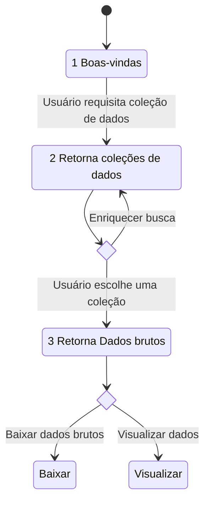

# Arquitetura Chatbot

## Diagrama de estados

## Explicação

1. **Boas vindas :** Dá boas vindas ao usuário e explica brevemente como o sistema funciona.
2. **Retorna coleções de dados :** Retorna uma lista de coleções de dados, o usuário pode escolher uma em meio a lista ou enriquecer a pergunta com filtros(datas, locais, nomes...) a fim de obter a coleção mais adequada.
3. **Retorna dados brutos :** Retorna dados brutos, o usuário pode optar entre baixa-los e analisa-los por conta própria ou pedir ao ChatBot para visualizar os dados em meio adequado.
4.

## Referenciais:

[9]A Chatbot for Searching and Exploring Open Data: Implementation and Evaluation in E-Government